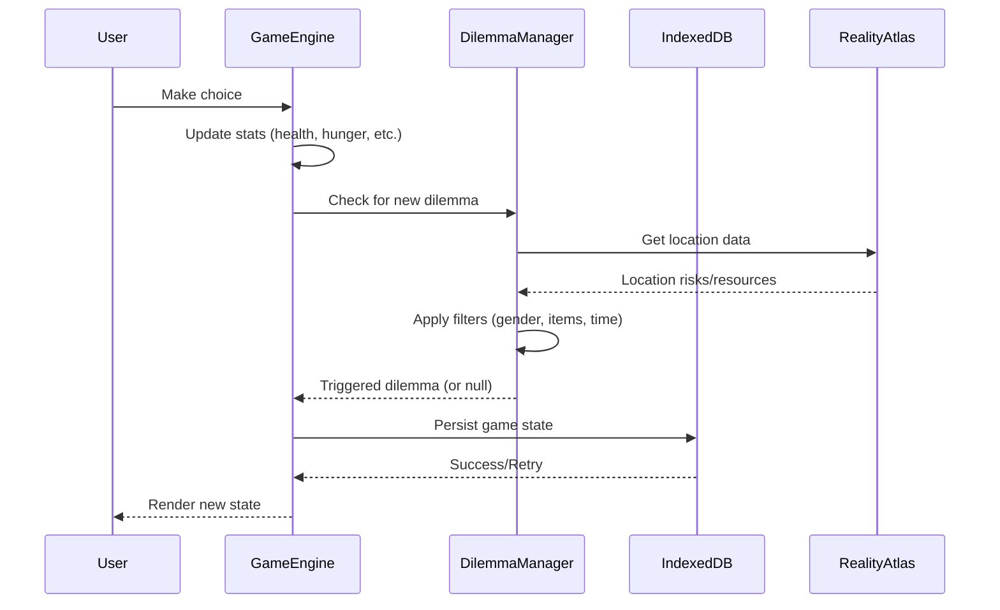
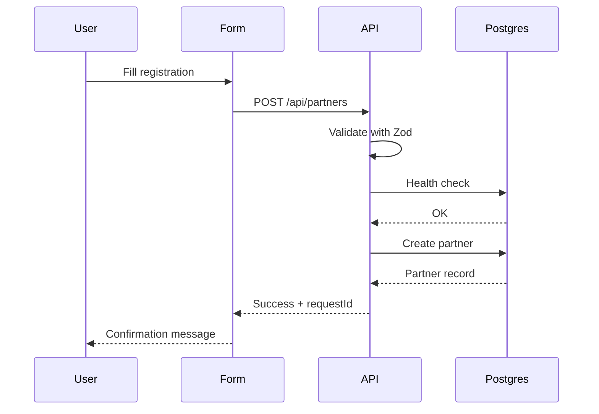

# Caminhos Campinas - System Architecture

## Overview

**Caminhos Campinas** is a serious game that simulates the lived experience of homelessness in Campinas, Brazil. The system combines narrative gaming, real-world data, and social impact features to raise awareness and support the homeless population.

## Architecture Diagram

```mermaid
graph TB
    subgraph "Client Layer"
        Browser[Web Browser]
        PWA[Progressive Web App]
        ServiceWorker[Service Worker]
    end

    subgraph "Frontend (Next.js)"
        Pages[Pages/Routes]
        GameEngine[Game Engine]
        DilemmaManager[Dilemma Manager]
        UI[UI Components]
    end

    subgraph "State Management"
        GameContext[Game Context]
        LocalStorage[LocalStorage]
        IndexedDB[(IndexedDB/PouchDB)]
    end

    subgraph "Backend (Next.js API)"
        PartnerAPI[/api/partners]
        AuthAPI[/api/auth]
        FeedbackAPI[/api/feedback]
    end

    subgraph "Data Layer"
        Postgres[(PostgreSQL)]
        RealityAtlas[Reality Atlas JSON]
        DilemmaData[Dilemmas JSON]
    end

    subgraph "External Services"
        Vercel[Vercel Hosting]
        Sentry[Sentry Monitoring]
        Analytics[Vercel Analytics]
    end

    Browser --> PWA
    PWA --> ServiceWorker
    ServiceWorker --> Pages
    Pages --> GameEngine
    GameEngine --> DilemmaManager
    GameEngine --> GameContext
    GameContext --> LocalStorage
    GameContext --> IndexedDB
    DilemmaManager --> RealityAtlas
    DilemmaManager --> DilemmaData
    Pages --> UI
    Pages --> PartnerAPI
    Pages --> AuthAPI
    Pages --> FeedbackAPI
    PartnerAPI --> Postgres
    AuthAPI --> Postgres
    FeedbackAPI --> Postgres
    Vercel --> Pages
    Sentry --> Pages
    Analytics --> Browser
```

## Core Components

### 1. Game Engine

**Location:** `src/features/game-loop/`

The game engine manages the core gameplay loop:

- **DilemmaManager**: Triggers dilemmas based on player state, location, and time
- **Story Arcs**: Thematic narrative sequences (Dignidade, Economia Solidária, etc.)
- **Reality Atlas**: Real-world locations and risks in Campinas

**Key Features:**
- Time-based triggers (Bom Prato meal times, shelter hours)
- Location-based events (proximity to Centro Pop, police activity)
- Dynamic difficulty based on avatar (race, gender affect risk)

### 2. State Management

**Location:** `src/contexts/GameContext.tsx`

Centralized state management using React Context:

```typescript
interface GameState {
  health: number;
  sanity: number;
  hunger: number;
  money: number;
  time: number;
  day: number;
  avatar: Avatar;
  resolvedDilemmas: string[];
  // ... more fields
}
```

**Persistence:**
- **LocalStorage**: Used for quick avatar/preference persistence
- **IndexedDB (via PouchDB)**: Full game state persistence, offline-first
- **Retry Logic**: 3 attempts with exponential backoff for AbortError

### 3. Data Persistence

#### IndexedDB Health Monitoring

**Location:** `src/features/offline-db/db-health.ts`

Resilient IndexedDB implementation:

```typescript
// Retry logic for AbortError
await initDBWithRetry(initPouchDB, maxRetries: 3);

// Quota monitoring
const { used, available, percentUsed } = await checkQuota();

// Database repair
await repairDatabase('pop_rua_game_db');
```

**Guards:**
- SSR detection: `typeof window === "undefined"`
- Next.js runtime: `process.env.NEXT_RUNTIME === "nodejs"`
- Feature detection: `"indexedDB" in window`

#### PostgreSQL (via Prisma)

**Location:** `prisma/schema.prisma`

Three main models:
1. **Partner**: NGOs, government agencies, companies
2. **DilemmaFeedback**: Player feedback on narrative realism
3. **Post**: Jornal da Rua community content

**Performance Indexes:**
- `@@index([category, status])` on Partner and Post
- `@@index([createdAt])` on all models for sorting

### 4. API Layer

#### Partner API

**Location:** `src/app/api/partners/route.ts`

**Features:**
- ✅ Zod schema validation
- ✅ Database health checks
- ✅ Request ID tracking
- ✅ Error sanitization (no stack traces in production)

**Example Request:**
```typescript
POST /api/partners
{
  "name": "ONG Exemplo",
  "category": "NGO",
  "whatsapp": "+5519999999999",
  "description": "Apoio a população em situação de rua"
}
```

**Example Response:**
```typescript
{
  "id": "uuid",
  "name": "ONG Exemplo",
  "status": "PENDING",
  "requestId": "req_1234567890_abc123"
}
```

## Data Flow

### Game Loop



### Partner Registration



## Deployment Architecture

### Vercel Platform

**Build Process:**
1. `prisma generate` - Generate Prisma Client
2. `next build` - Build Next.js app
3. Deploy to Vercel edge network

**Environment Variables:**
- `DATABASE_URL`: PostgreSQL connection string (pooled)
- `DIRECT_URL`: Direct PostgreSQL connection (migrations)
- `NEXTAUTH_SECRET`: Authentication secret
- `NEXTAUTH_URL`: App URL for OAuth callbacks

**Monitoring:**
- Vercel Analytics: User metrics
- Sentry: Error tracking
- Vercel Logs: API request logs

## Offline-First Strategy

1. **Service Worker** caches app shell and static assets
2. **IndexedDB** stores full game state locally
3. **PouchDB** enables future sync capabilities
4. Game fully playable without network connection

## Security Considerations

1. **Input Validation**: All API inputs validated with Zod
2. **SQL Injection**: Protected via Prisma parameterized queries
3. **Error Exposure**: Stack traces hidden in production
4. **Rate Limiting**: (TODO) Add rate limiting to public APIs

## Performance Optimizations

1. **Database Indexes**: Fast queries on category, status, createdAt
2. **Connection Pooling**: Prisma connection pooling for Vercel
3. **Auto-compaction**: PouchDB auto-compaction enabled
4. **Lazy Loading**: Dynamic imports for PouchDB modules

## Monitoring & Observability

1. **Health Checks**: Database health check on every API request
2. **Request IDs**: Unique ID for tracing requests across logs
3. **Quota Monitoring**: IndexedDB quota warnings at 80% usage
4. **Error Logging**: Structured logging with context

## Future Enhancements

1. **Real-time Sync**: PouchDB → CouchDB synchronization
2. **Multiplayer**: Shared dilemmas between players
3. **Admin Dashboard**: Partner moderation interface
4. **Mobile Apps**: React Native wrapper for app stores
