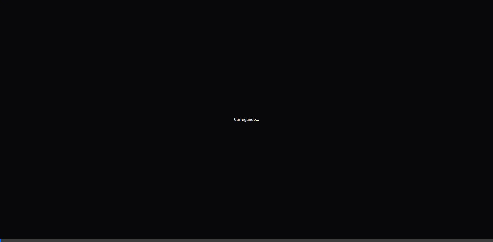

# Projeto Caminhos Campinas - Atualização de Logo e Tour Visual

Concluímos a atualização da identidade visual e a documentação em vídeo do projeto. Abaixo estão os detalhes das alterações e os registros realizados.

## Alterações Realizadas

### 1. Logo e Identidade Visual
- **Processamento de Logo:** Recebemos uma nova imagem de logo (coração + pin) com texto. Realizamos um recorte inteligente via script Python para isolar o ícone e remover as etiquetas de texto.
- **Navbar (Menu Superior):**
  - Substituímos o placeholder "CC" pelo novo ícone recortado (`/logo-cropped.png`).
  - Removemos o texto "Caminhos Campinas" ao lado do ícone para um design mais limpo e minimalista.
### 2. Documentação em Vídeo (Walkthrough)
Realizamos tours completos pelo projeto, garantindo o "Full Scroll" (rolagem total) de todas as páginas principais para permitir a gravação de áudio sobre o conteúdo.

#### Vídeo 1: Versão Local (localhost:3000)
Toda a aplicação rodando no ambiente de desenvolvimento, incluindo as últimas atualizações de UI.

#### Vídeo 2: Versão Web (Produção)
A aplicação carregada diretamente da URL oficial na Vercel.

## Páginas Percorridas nos Vídeos
- **Home:** Visão geral e pilares do projeto.
- **Guia de Rua (/recursos):** Mapa e rede de serviços (Alimentação, Saúde, etc).
- **O Abismo (/impacto):** Painel de dados e impacto social.
- **Jornal da Rua (/jornal):** Conteúdo narrativo e denúncias.
- **Rede (/hub):** Mapeamento da rede solidária.
- **O Jogo (/jogar):** Início da experiência interativa.
